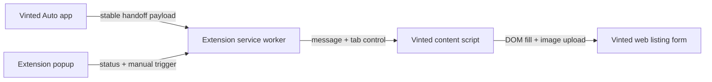

# Vinted Extension Architecture

Last updated: 2026-04-29

## Purpose

This document defines the recommended technical shape for the Vinted extension MVP.

The design priority is:

`simple -> reliable -> easy to repair when Vinted changes`

## High-level architecture

## Core components

### 1. App-side handoff endpoint

The app must expose one stable payload endpoint.

Recommended shape:

- `GET /api/vinted/handoffs/latest`
- or `GET /api/vinted/handoffs/:draftId`

Payload should include:

- payload version
- draft id
- account id
- title
- description
- price
- brand
- category
- size
- condition
- color
- material
- notes
- ordered image URLs served by the app

The extension should never reconstruct listing data itself.

### 2. Extension service worker

The service worker should own:

- current configuration
- app origin
- last loaded payload metadata
- tab open/update logic
- message routing

It should not own DOM selectors.

### 3. Content script

The content script should own:

- page detection
- DOM adapter lookup
- field fill operations
- image upload operations
- success/failure reporting back to the extension

It should not own global extension state.

### 4. Popup

The popup should stay small.

It should show:

- connected app origin
- current page support status
- latest loaded listing id
- `Fill current page`
- `Open Vinted and fill`

No large dashboard logic in the popup.

## Recommended manifest shape

Use Manifest V3 with:

- `background.service_worker`
- `permissions`: `storage`
- `host_permissions`:
  - Vinted domains in scope
  - local app origin such as `http://127.0.0.1:3000/*`
- `content_scripts` for supported Vinted URL matches

Start with a small host list.

Do not request broader host permissions than needed.

## Handoff strategy

Recommended first-pass handoff flow:

1. app creates or updates current handoff payload
2. seller clicks `Fill on Vinted`
3. app opens or focuses Vinted listing page
4. extension service worker fetches latest payload from app origin
5. content script fills page
6. extension reports success or field-level failures
7. user reviews and submits

This is simpler than trying to push large payloads through query params or clipboard hacks.

## DOM adapter strategy

Do not scatter raw selectors across the extension.

Use one adapter module for Vinted form filling.

Recommended structure:

- `detectVintedListingPage()`
- `findTitleField()`
- `findDescriptionField()`
- `findPriceField()`
- `findBrandField()`
- `findCategoryField()`
- `findConditionField()`
- `findColorField()`
- `findMaterialField()`
- `findSizeField()`
- `findImageInput()`

All selectors and interaction quirks should stay inside this adapter.

## Selector rules

Prefer:

- semantic labels
- stable `name`, `id`, or `aria-*`
- role-based lookup
- visible field labels

Avoid:

- hashed class names
- brittle deep DOM traversal
- positional selectors that assume exact layout

## Image upload strategy

The simplest reliable approach is:

- extension fetches image blobs from app-served URLs
- converts them to `File`
- populates the page file input via `DataTransfer`
- dispatches the input/change events the page expects

The app remains owner of the original files.

The extension should only fetch and hand them to the page.

## Error model

The extension should report failures in a structured way:

- unsupported page
- app unavailable
- payload unavailable
- missing required payload field
- selector not found
- upload failed
- partial fill complete

Do not collapse everything into `fill failed`.

## Versioning rule

The payload contract must carry a version.

Reason:

- app and extension may be updated at different times
- versioned payloads prevent silent breakage

## First release non-goals

Do not include:

- automatic publish
- background retries on Vinted
- edit existing live listing support
- multi-market selector abstraction before first market works
- per-field AI logic inside the extension

## Definition of good architecture

This architecture is good if:

- most product logic stays in the app
- most Vinted-specific fragility stays in one adapter
- extension remains small and replaceable
- debugging a broken field fill is straightforward
