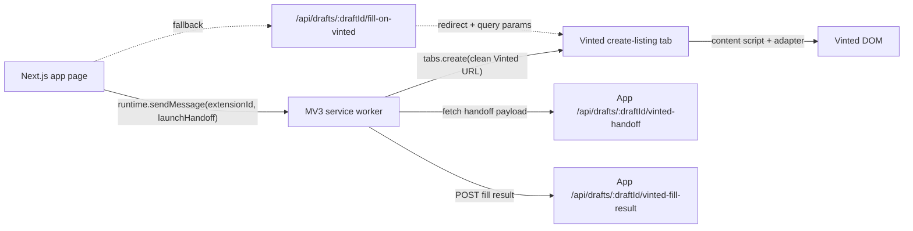

# Vinted Extension Recommended Bridge Architecture

Last updated: 2026-05-03

## Goal

Make the Vinted handoff:

`clean to launch -> easy to debug -> safe to repair`

## Recommended architecture

## Rules

### Rule 1. The app sends context, not full listing payload

App page should send:

- `draftId`
- `appOrigin`

App page should not send:

- title
- description
- images
- full payload JSON

Reason:

- app remains source of truth
- service worker fetches the latest reviewed payload
- extension protocol stays small

### Rule 2. Service worker owns launch and network

Service worker responsibilities:

- validate external launch request
- save pending launch state
- open the clean Vinted create page
- fetch payload from the app
- post result back to the app

It should not own:

- raw field selectors
- DOM interaction logic

### Rule 3. Content script owns DOM only

Content script responsibilities:

- detect supported Vinted page
- ask adapter for fields
- fill fields
- upload images
- return field-level diagnostics

It should not own:

- launch orchestration
- global extension state
- arbitrary cross-origin fetching

### Rule 4. Keep fallback route until the bridge is boring

Fallback route still matters for:

- local development without stable extension ID
- recovery when the direct bridge is not configured
- manual smoke tests

Do not remove it yet.

## Storage model

### `chrome.storage.local`

Use for:

- config
- last context
- last fill result

### `chrome.storage.session`

Use for:

- pending launch state
- target tab ID
- transient worker-safe handoff state

Reason:

- survives service-worker restarts
- stays session-scoped
- cleaner than globals

## Launch sequence

### Preferred path

1. user clicks `Fill on Vinted`
2. app page calls extension with `draftId` and `appOrigin`
3. service worker stores pending launch in `storage.session`
4. service worker opens clean `createListingUrl`
5. content script loads on Vinted
6. service worker waits for the tab to be ready
7. service worker fetches `/api/drafts/:draftId/vinted-handoff`
8. service worker sends payload to content script
9. content script fills page and returns diagnostics
10. service worker posts `/api/drafts/:draftId/vinted-fill-result`

### Fallback path

1. app opens `/api/drafts/:draftId/fill-on-vinted`
2. route redirects to Vinted with query params
3. content script primes the worker from URL params
4. worker continues with the same payload/fill/report loop

## Image transport recommendation

Best long-term shape:

- service worker fetches image bytes from the app
- content script receives bounded binary payload or another safe extension-owned transport
- content script only writes to the file input

Current repo shape:

- content script fetches image URLs directly

Why that is weaker:

- Chrome docs say content scripts are still subject to the page origin for
  cross-origin requests
- this is the most likely part of the stack to become flaky across markets or
  browsers

## Security boundaries

Keep these boundaries:

- app only allowlists known extension origins when needed
- extension only allowlists known app origins with `externally_connectable.matches`
- external message carries bounded fields, not arbitrary URLs
- service worker never accepts a content-script request to fetch an arbitrary host
- manual submit remains required

## What changed in the repo

This architecture pass adds:

- `extension/handoff-protocol.js`
- `lib/vinted/extension-protocol.ts`
- `lib/vinted/extension-bridge.ts`
- `externally_connectable` manifest config
- service-worker pending launch state in `storage.session`
- app-side direct bridge attempt with fallback to the older route

## Next technical step after this

Highest-value follow-up:

`move image fetch out of the content script`
