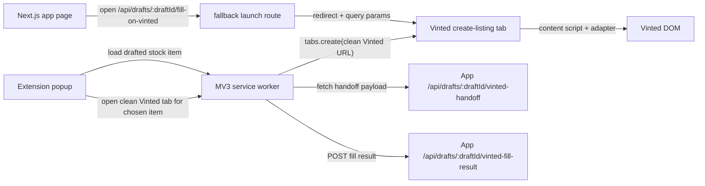

# Vinted Extension Recommended Bridge Architecture

Last updated: 2026-05-03

## Goal

Make the Vinted handoff:

`clean to launch -> easy to debug -> safe to repair`

## Recommended architecture

```mermaid
flowchart LR
  A["Next.js app page"] -->|"open /api/drafts/:draftId/fill-on-vinted"| G["fallback launch route"]
  G -->|"redirect + query params"| C["Vinted create-listing tab"]
  H["Extension popup"] -->|"load drafted stock item"| B["MV3 service worker"]
  H -->|"open clean Vinted tab for chosen item"| B
  B -->|"tabs.create(clean Vinted URL)"| C
  B -->|"fetch handoff payload"| D["App /api/drafts/:draftId/vinted-handoff"]
  C -->|"content script + adapter"| E["Vinted DOM"]
  B -->|"POST fill result"| F["App /api/drafts/:draftId/vinted-fill-result"]
```

## Rules

### Rule 1. The app sends context, not full listing payload

App page should send:

- `draftId`
- `appOrigin`

App page should not send:

- title
- description
- images
- full payload JSON

Reason:

- app remains source of truth
- service worker fetches the latest reviewed payload
- extension protocol stays small

### Rule 2. Service worker owns launch and network

Service worker responsibilities:

- validate external launch request
- save pending launch state
- open the clean Vinted create page
- fetch payload from the app
- post result back to the app

It should not own:

- raw field selectors
- DOM interaction logic

### Rule 3. Content script owns DOM only

Content script responsibilities:

- detect supported Vinted page
- ask adapter for fields
- fill fields
- upload images
- return field-level diagnostics

It should not own:

- launch orchestration
- global extension state
- arbitrary cross-origin fetching

### Rule 4. Keep fallback route until the bridge is boring

Fallback route still matters for:

- local development without stable extension ID
- recovery when the direct bridge is not configured
- manual smoke tests

Do not remove it yet.

## Storage model

### `chrome.storage.local`

Use for:

- config
- last context
- last fill result

### `chrome.storage.session`

Use for:

- pending launch state
- target tab ID
- transient worker-safe handoff state

Reason:

- survives service-worker restarts
- stays session-scoped
- cleaner than globals

## Launch sequence

### App path

1. user clicks `Fill on Vinted`
2. app opens `/api/drafts/:draftId/fill-on-vinted`
3. route redirects to Vinted with query params
4. content script primes the worker from URL params
5. service worker fetches `/api/drafts/:draftId/vinted-handoff`
6. service worker sends payload to content script
7. content script fills page and returns diagnostics
8. service worker posts `/api/drafts/:draftId/vinted-fill-result`

### Popup path

1. user opens the extension popup
2. popup loads drafted stock items from the app
3. user clicks `Load` or `Open on Vinted`
4. worker stores the chosen draft context
5. worker opens clean `createListingUrl` when requested
6. worker continues with the same payload/fill/report loop

## Image transport recommendation

Best long-term shape:

- service worker fetches image bytes from the app
- content script receives bounded binary payload or another safe extension-owned transport
- content script only writes to the file input

Current repo shape:

- service worker fetches image bytes from the app
- service worker relays prepared image payloads to the content script in
  smaller per-image messages
- content script only reconstructs `File` objects and writes the input

Remaining tradeoff:

- Chrome message passing is JSON-based, so image relay currently uses base64
- larger drafts need chunked relay because one giant message can exceed
  Chrome's `tabs.sendMessage` size cap
- very large image sets may still justify a more advanced extension-owned
  transport later

## Security boundaries

Keep these boundaries:

- app only allowlists known extension origins when needed
- extension only allowlists known app origins with `externally_connectable.matches`
- external message carries bounded fields, not arbitrary URLs
- service worker never accepts a content-script request to fetch an arbitrary host
- manual submit remains required

## What changed in the repo

This architecture pass adds:

- `extension/handoff-protocol.js`
- `lib/vinted/extension-protocol.ts`
- `lib/vinted/extension-bridge.ts`
- `externally_connectable` manifest config
- service-worker pending launch state in `storage.session`
- popup-side drafted-stock picker plus the older route-based app launch

## Next technical step after this

Highest-value follow-up:

`stabilize extension install/ID workflow and run live Vinted smoke checks`
