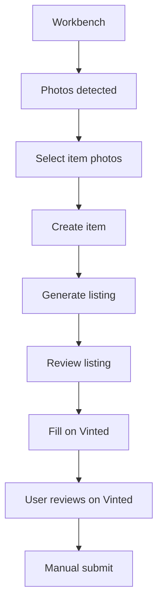
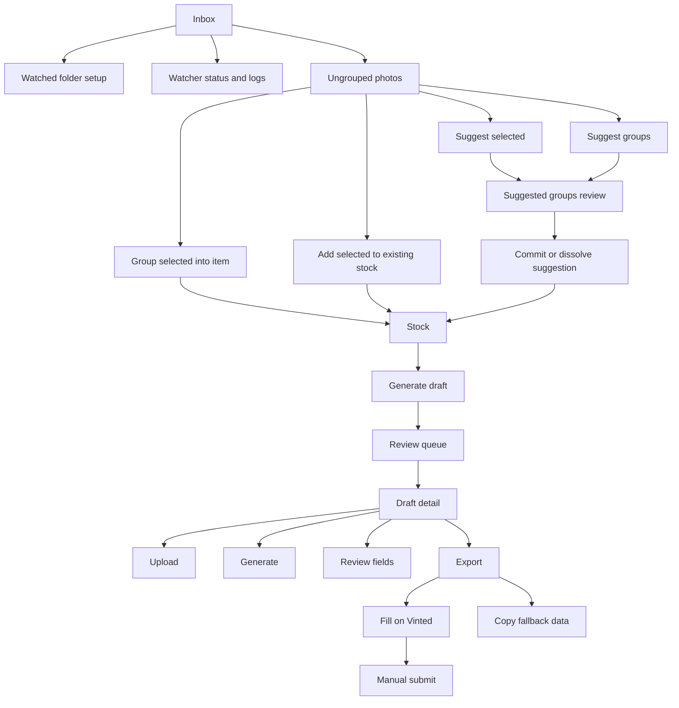
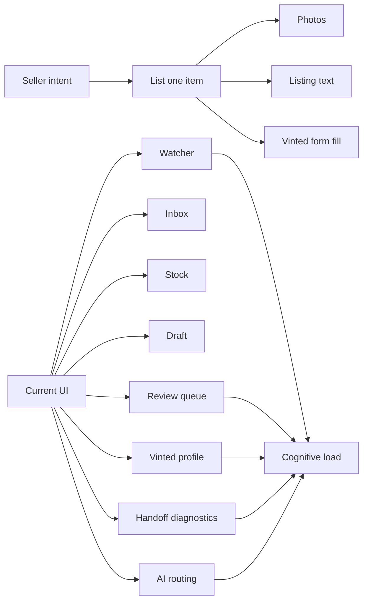
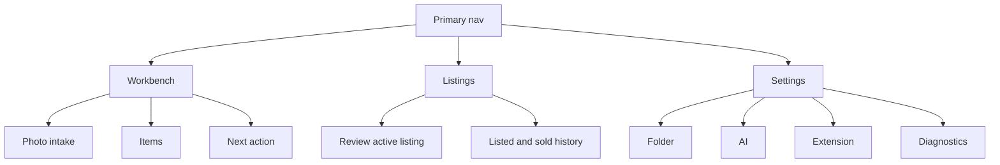
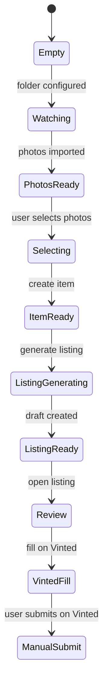
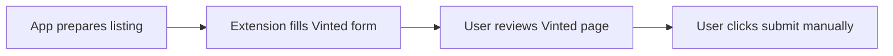

# Simplified UX Flow Reference

Last updated: 2026-05-11

## Purpose

This is the flow reference for the simplified UX implementation. Use it to keep
screen changes aligned around the seller journey instead of internal objects.

## Core Flow

## Current Flow

## Complexity Sources

## Target IA

## Workbench States

## Screen Responsibilities

### Workbench

Primary job:

Help the seller turn photos into the next listing.

Visible first:

- Folder status.
- Photos needing grouping.
- Items needing listing generation.
- One next action.

Hidden or secondary:

- Last start time.
- Last event time.
- Last scan time.
- Last import time.
- Imported file count.
- Grouping run notes.
- Watcher implementation language.

### Listings

Primary job:

Help the seller review, fill, and track listings.

Visible first:

- Listing requiring review.
- Required missing fields.
- Main next action.
- Queue position if in queue mode.

Hidden or secondary:

- Generation history.
- Draft ID.
- Selector diagnostics.
- JSON handoff.
- Individual copy buttons.

### Settings

Primary job:

Let the seller or maintainer configure low-frequency controls.

Visible first:

- Folder path.
- AI preset.
- Extension status.

Hidden or secondary:

- Base URLs.
- Timeouts.
- API key clearing.
- Provider test history.
- Advanced model guidance.

## UI Copy Reference

Use seller verbs:

- `Create item`
- `Generate listing`
- `Review listing`
- `Fill on Vinted`
- `Open listing`
- `Fix missing fields`
- `Scan photos`
- `Change folder`

Avoid first-level internal words:

- `watcher`
- `session`
- `stock`
- `draft`
- `handoff`
- `payload`
- `selector`
- `route`
- `profile schema`

Allowed in advanced/debug areas:

- `Watcher`
- `Draft ID`
- `Selector diagnostics`
- `Autofill JSON`
- `Vinted profile`
- `Provider`

## Primary Action Rules

Each main screen should answer:

- What is the current item?
- What is wrong or missing?
- What should the seller do next?

Per screen:

- Empty Workbench: primary action is `Open folder` or `Scan photos`.
- Photos present: primary action is `Create item`.
- Item without listing: primary action is `Generate listing`.
- Listing incomplete: primary action is `Fix missing fields`.
- Listing ready: primary action is `Fill on Vinted`.
- Vinted filled: primary action is `Mark listed` or leave final submit on Vinted.

## Edge Cases

No photos:

- Show folder path and a short empty state.
- Keep `Scan photos` visible.
- Keep folder debug collapsed.

Photos but no selection:

- Disable `Create item`.
- Explain with one short line: `Select photos for one item.`

AI unavailable:

- Keep item creation working.
- Show `AI needs setup` near `Generate listing`.
- Link to Settings.

Vinted fill unavailable:

- Keep copy fallback available under `Advanced`.
- Say `Use copy fallback` instead of exposing JSON first.

## Manual Submit Boundary

Always preserve this boundary:

The app may prepare and fill. The user decides final publish.
