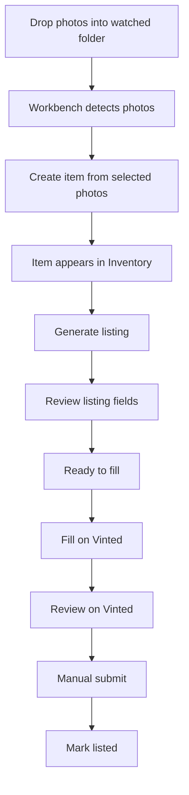

# Inventory Management UX Plan

Last updated: 2026-05-17

## Purpose

This plan defines the next UX implementation slice for the seller management
surface.

The current app has the right underlying workflow, but the management UI splits
one seller job across too many places:

- Workbench shows newly created items.
- `/stock` shows stock items and generation actions.
- `/review` is labeled Listings, but behaves like a single-item review queue.
- `/drafts` is closer to a listing archive, but is secondary and hidden.

The next slice should make one page answer:

`what items do I have, what state are they in, and what should I do next?`

## Product Decision

Make `Inventory` the main management page.

Primary navigation should become:

- `Workbench`: photo intake and item creation.
- `Inventory`: all items, listings, statuses, and next actions.
- `Settings`: folder, AI, extension, and diagnostics.

Keep the existing data model for the first pass. Do not rename internal
`StockItem`, `Draft`, or `ReviewQueue` types yet. Change the visible UI first.

## Target Flow

## UX Principle

Inventory is not another dashboard.

It should behave like a compact stock-management surface:

- dense enough for repeated seller work
- thumbnail-first
- one row per item/listing
- status visible at a glance
- one primary next action per row
- filters based on seller work, not internal queue states

## First Implementation Slice

Replace `/review` with an Inventory workspace.

Scope:

- Change top navigation label from `Listings` to `Inventory`.
- Keep route path `/review` for the first pass to avoid route churn.
- Build an Inventory view model from current `sessions`, `stockItems`, and
  linked `drafts`.
- Show every current item, including items without generated listings.
- Show linked draft/listing data when a draft exists.
- Keep existing draft detail pages as the editor.
- Keep existing server actions for generation, save review, fill on Vinted, and
  status changes.

Do not delete `/stock` or `/drafts` in the first slice. Leave them as secondary
or compatibility routes until Inventory proves the flow.

## Inventory Layout

Desktop default:

- table or table-like list
- sticky or compact header
- one row per item
- thumbnails in the first column
- primary action at the far right

Mobile default:

- card list
- same information hierarchy as desktop
- action button visible without opening advanced details

Columns:

- `Photo`
- `Item`
- `Status`
- `Price`
- `Category / Size`
- `Photos`
- `Updated`
- `Next action`

Top filters:

- `Action needed`
- `Needs listing`
- `Needs review`
- `Ready to fill`
- `Filled / fix needed`
- `Listed`
- `All`

Default filter:

- `Action needed`

## Seller-Facing Statuses

Use seller-facing statuses in Inventory:

- `Needs listing`
- `Needs review`
- `Ready to fill`
- `Filled on Vinted`
- `Needs manual fix`
- `Listed`
- `Sold`

Optional later status:

- `Generation failed`

Do not add `Generation failed` in the first pass unless generation failures are
persisted. Avoid fake state.

## Status Derivation

First pass should derive Inventory status from existing state:

- `Needs listing`: stock item has no linked draft.
- `Needs review`: linked draft exists but required listing/Vinted fields are not
  ready.
- `Ready to fill`: linked draft is ready and has not been filled/listed/sold.
- `Filled on Vinted`: draft handoff status is `filled_on_vinted`.
- `Needs manual fix`: draft handoff status is `needs_manual_fix` or
  `fill_failed`.
- `Listed`: draft status is `listed`.
- `Sold`: draft status is `sold`.

Precedence should favor terminal and urgent states:

1. `Sold`
2. `Listed`
3. `Needs manual fix`
4. `Filled on Vinted`
5. `Needs listing`
6. `Needs review`
7. `Ready to fill`

## Next Action Rules

Each row should have one main action:

- `Generate listing`: item has no linked draft.
- `Review listing`: listing exists but fields are incomplete.
- `Fill on Vinted`: listing is ready.
- `Fix Vinted fill`: extension fill failed or needs manual fixes.
- `Mark listed`: Vinted was filled, user still needs to record listed state.
- `Open listing`: listed or sold item.

Secondary actions should be hidden behind row details or an overflow area:

- rename item
- change cover
- move photos
- remove item
- copy fallback data
- view diagnostics
- restore generation

## Route Strategy

First pass:

- `/` remains Workbench.
- `/review` becomes Inventory.
- `/drafts/[draftId]` remains the listing editor/detail route.
- `/drafts` remains a secondary archive for compatibility.
- `/stock` remains a secondary compatibility route.

Later cleanup:

- Add `/inventory` as the canonical route.
- Redirect `/review` to `/inventory`.
- Decide whether `/stock` should redirect to Inventory or remain a narrow item
  maintenance page.
- Decide whether `/drafts` should be archive-only or removed from primary use.

## Component Strategy

Prefer a small number of focused pieces:

- `InventoryPage`
- `InventoryFilterTabs`
- `InventoryTable`
- `InventoryMobileCards`
- `InventoryStatusBadge`
- `InventoryRowAction`

Avoid a broad design-system refactor. Reuse existing `Card`, `Badge`, `Button`,
and `PendingSubmitButton` components.

## Data Strategy

Do not change persistence in the first pass.

Build a read-only view model from:

- `listAllSessionDetails()`
- `draftRepository.list()`
- existing draft readiness helpers
- existing Vinted handoff state

The view model should flatten each stock item into an inventory row:

- stock item identity
- cover photo URL info
- linked draft summary when present
- derived seller status
- derived next action
- searchable labels

Manual drafts without a stock item should still appear, but mark their source as
`Manual listing`. This avoids hiding edge-case data.

## Implementation Phases

### Phase 1: Inventory View Model

Goal:

Create the derived data shape without changing routes or UI behavior.

Tasks:

- Add helper for inventory status derivation.
- Add helper for next-action derivation.
- Add helper that combines stock items and drafts into inventory rows.
- Include manual drafts not linked to stock items.

Acceptance:

- Items without drafts appear as `Needs listing`.
- Items with incomplete drafts appear as `Needs review`.
- Ready drafts appear as `Ready to fill`.
- Filled/failed/listed/sold states are derived correctly.

### Phase 2: Inventory Page Shell

Goal:

Replace the `/review` queue landing behavior with a management page.

Tasks:

- Update nav label to `Inventory`.
- Render summary counts.
- Render filter tabs.
- Render table-like desktop list.
- Render card list on mobile.
- Keep links/actions wired to existing routes/actions.

Acceptance:

- `/review` no longer opens the first queue item automatically.
- A seller can scan all items before choosing what to do.
- Default view shows action-needed rows.

### Phase 3: Row Actions

Goal:

Make each row operational.

Tasks:

- Wire `Generate listing` to the existing stock generation action.
- Link `Review listing` to the existing draft detail route.
- Link or trigger `Fill on Vinted` using the existing fill endpoint.
- Support `Mark listed` through existing status action.
- Keep diagnostics and copy fallback out of the row by default.

Acceptance:

- Every visible row has one obvious next action.
- Secondary actions do not compete with the next action.
- Existing draft editor still works.

### Phase 4: Compatibility Cleanup

Goal:

Reduce duplicate mental models after Inventory is working.

Tasks:

- Make `/stock` link back to Inventory or narrow it to maintenance.
- Make `/drafts` archive-only and secondary.
- Update copy in Workbench to point created/generated items to Inventory.
- Consider adding `/inventory` and redirecting `/review`.

Acceptance:

- Primary nav has no queue/archive ambiguity.
- Seller-facing copy uses `item`, `listing`, and `Inventory`.
- No workflow disappears.

## Verification

Docs-only planning change:

- review markdown diff
- confirm docs index links are valid

Implementation phase:

- `corepack pnpm lint`
- `corepack pnpm typecheck`
- browser smoke at desktop width
- browser smoke at mobile width

Manual smoke path:

1. Open Workbench.
2. Create an item from photos.
3. Open Inventory.
4. Confirm item appears as `Needs listing`.
5. Generate listing.
6. Confirm item changes to `Needs review` or `Ready to fill`.
7. Review listing fields.
8. Fill on Vinted.
9. Confirm handoff status is visible.
10. Mark listed.

## Non-Goals

Do not include these in the first Inventory slice:

- AI output quality changes
- model benchmarking
- stock sync across computers
- import/export bundles
- order management
- finance/profit tracking
- private Vinted API automation
- final publish automation
- broad route renaming
- storage schema rewrite

## Definition Of Done

The Inventory UX slice is done when:

- Primary nav says `Inventory`.
- `/review` shows a stock-management page instead of opening a queue item.
- Items without listings and listings with drafts appear together.
- Seller-facing filters replace `Needs review`, `Ready`, `Listed`,
  `All generated`.
- Every row/card has one clear next action.
- Existing listing editor and Vinted fill still work.
- Lint and typecheck pass.
- Desktop and mobile smoke checks pass.
