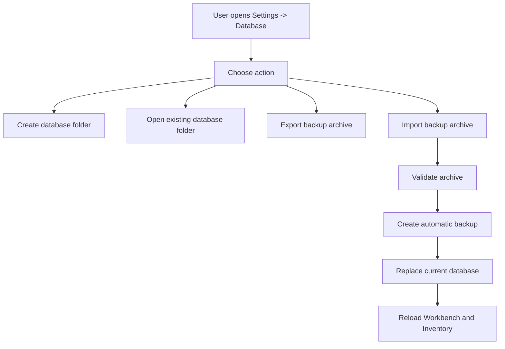

# Database Portability Plan

Last updated: 2026-05-18

## Purpose

Vinted Auto is local-first. That is good for photos, extension work, and personal
AI setup, but it creates one big problem:

`each computer has its own .data folder, so stock and listings drift apart`

This plan defines a viable way to create, save, export, import, and later share
databases without changing the product into a hosted SaaS.

## Current Finding

The project does not currently have one database file.

Current local data lives under `.data`:

- `studio-sessions.json`
- `drafts.json`
- `inbox-watcher.json`
- `ai-settings.json`
- `session-photo-assets/`
- `draft-images/`
- development logs

That means any portability feature must move both metadata and files. Exporting
only JSON is not enough because Inventory rows and drafts depend on stored image
paths.

## Product Decision

Use a managed `Database folder` first.

Do not migrate to SQLite or a hosted database yet.

Reason:

- current JSON schema already works
- photos are already file-based
- fastest safe path is packaging the existing `.data` bundle
- cloud folders such as OneDrive, Dropbox, Google Drive, or a USB drive can host
  the database folder when the user wants the same data on multiple computers
- hosted sync can come later if simultaneous multi-computer use becomes real

## Target Mental Model

In Settings, the user should see:

- current database path
- create database
- open existing database
- export backup
- import backup
- save backup before risky operations

The app should explain:

- one active database at a time
- one computer should edit a shared database at a time
- imports can replace or merge depending on mode
- API keys are not exported by default

## Recommended First Slice

Build `Database portability` as a Settings feature.

Scope:

- introduce a single data-root helper for all `.data` paths
- add a database manifest file
- add export archive creation
- add import validation
- add replace-current import with automatic backup
- keep merge import for later

Do not change app workflow, Inventory, extension, or AI logic in this slice.

## Why Not SQLite First

SQLite would improve transactions for metadata, but it does not solve image
portability by itself. The app would still need image export/import and backup
packaging.

SQLite also adds migration risk while the workflow is still changing quickly.

Use SQLite later only if:

- JSON write corruption happens again
- merge logic becomes too hard with JSON files
- hosted sync is delayed but local data volume grows

## Why Not Hosted Database First

Hosted DB plus object storage is the cleanest true multi-computer solution, but
it changes the product boundary:

- auth is required
- image storage costs exist
- local AI and extension flows need remote-safe secrets
- offline use becomes weaker
- migration blast radius is larger

Keep hosted sync as a future option, not the next implementation step.

## Database Modes

### Local Default

Current behavior.

Data root:

`.data`

Best for single computer work.

### Portable Folder

User selects a folder in cloud storage or external drive.

Example:

`C:\Users\USER\OneDrive\VintedAuto\Database`

Best for one active computer at a time.

### Archive Backup

User exports a `.vintedauto.zip` archive.

Best for manual transfer between computers, cold backups, and rollback before
large changes.

### Hosted Sync

Future mode.

Best for multiple active computers, team workflows, remote stock admin, and
automatic conflict resolution.

## Import Modes

### Validate Only

Read archive or database folder and report:

- app version
- export version
- item count
- draft count
- image count
- missing files
- secret status
- compatibility warnings

No data changes.

### Replace Current

Safest MVP import.

Process:

1. pause watcher
2. create automatic backup of current database
3. validate incoming database
4. replace current data root
5. restart app data reads
6. show import summary

Use this for moving from one computer to another.

### Merge

Later.

Merge current database with imported database by stable IDs.

Rules must be explicit before implementation because stock, drafts, and images
can conflict.

## Security Decision

Never export API keys by default.

`ai-settings.json` currently can contain:

- OpenAI API key
- Anthropic API key
- local provider settings
- model choices
- health-test history

Default export should include routing/model settings but redact secrets:

```json
{
  "openAiApiKey": null,
  "anthropicApiKey": null
}
```

Optional secret export can be added later, but it must require an explicit
warning because the archive is a plain local file.

## Data Integrity Requirements

Before import/export becomes user-facing, add:

- atomic JSON writes: temp file then rename
- per-file write queues for drafts and sessions
- manifest checksums for exported files
- pre-import backup
- import dry-run validation
- watcher pause during import

This feature touches user stock data. It needs stricter safety than normal UI
changes.

## Target Flow



## Success Criteria

The first implementation is done when:

- user can see current database path
- user can export a full backup containing JSON and images
- user can import a backup on another computer
- import does not include API keys unless explicitly allowed
- current data is automatically backed up before replacement
- broken archives fail before changing local data
- Inventory and draft images load after import

## Main Risks

### Missing Images

Metadata can reference files that are absent from the archive.

Fix:

- validate all `storagePath` references before import
- report missing paths clearly
- block replace import unless user chooses advanced recovery later

### Cloud Folder Conflicts

OneDrive or Dropbox can create conflicted JSON copies if two computers edit at
the same time.

Fix:

- use one active computer at a time for portable folders
- add a lock file with machine name, process ID, and timestamp
- warn if a fresh lock belongs to another machine

### Secrets Leak

AI settings can include API keys.

Fix:

- redact secrets by default
- document what is exported
- add explicit opt-in only if needed later

### Destructive Import

Replace import can overwrite local work.

Fix:

- automatic pre-import backup
- validate first
- show summary before final replace
- keep backup path visible after import

## Recommended Next Step

Implement Phase 1:

`data-root helper + database manifest + export-only archive`

Do not implement destructive import until export validation and pre-import
backup are working.
